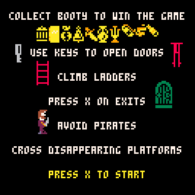
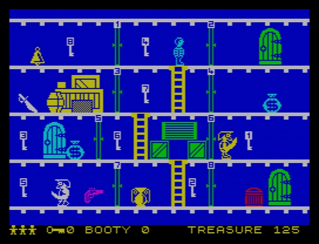

# Booty Demake

Based on the 1984 game, Booty, by John Cain, for the Commodore 64, ZX Spectrum and Amstrad CPC (and remakes for Sam Coupe, Amiga and PC).

Pico-8 Coding & Graphics by Nate Taylor

Original Design by John F. Cain

## Overview

Jim the Cabin Boy has to collect all the items of Booty from the ship's 20 cabins by collecting keys that open locked doors. Hazards include the pirates who patrol the rooms, rats which crawl along the deck and the ships parrot which flies around the ship. Also some booty is booby trapped and explodes when Jim tries to collect it.

### Instructions

Press Z if you get stuck on any level.

## Pico-8 Version - Bootyful

[Web version](booty-demake.html)

- [Pico-8 Cartridge](booty-demake.p8.png)
- [Source Code](booty-demake.p8)
- [Sprite Sheet](extra/booty-demake-spritesheet.png)
- [Music Clip](extra/booty-demake-music.wav)
- [Sound Effects](extra/booty-demake-sfx.wav)
- [Gameplay Video](extra/booty-demake-video.gif)

**This is a Beta Version**

This game is completable, but is considered in beta until the following is fully implemented:

- Traveling platforms
- Rats & Birds
- Booby Traps

[Bugs & Issues](bugs.md)

## Original Version

[Walkthrough video](https://youtu.be/ifhQmO9osQE)

[Level map](extra/booty-original-map.jpg)

Original Screenshot 

- ZX Spectrum - 256×192 pixels, 8 colors, 48k RAM
- Commodore 64, Amstrad CPC - 160×200 pixels, 16 colors, 64k RAM
